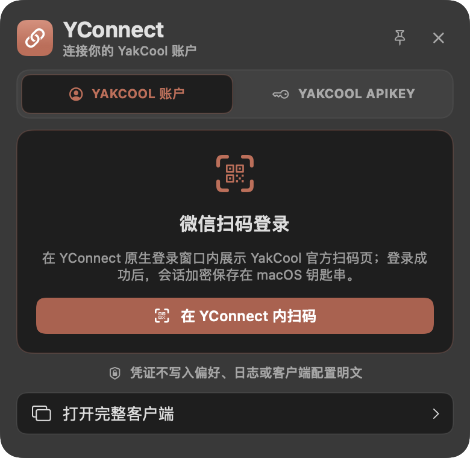
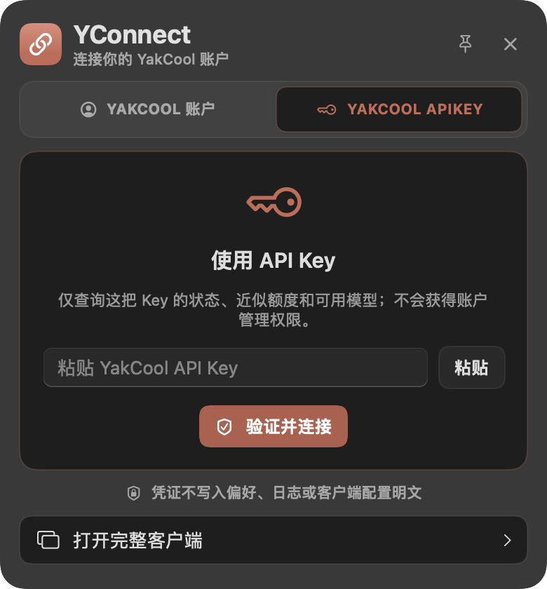
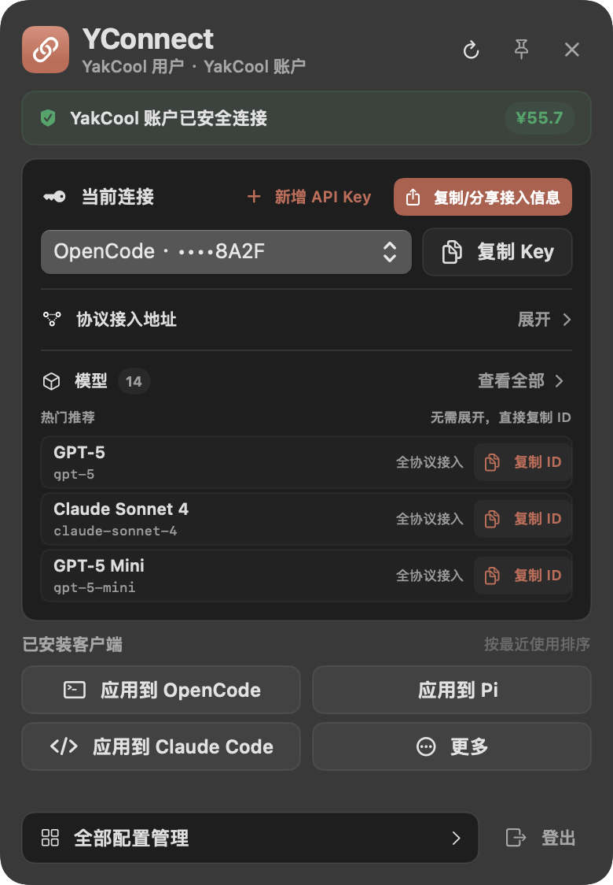
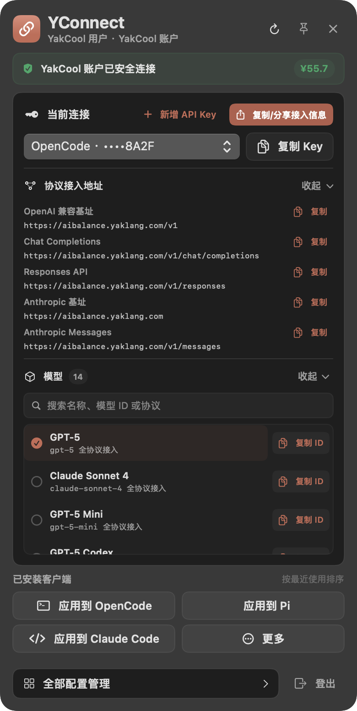
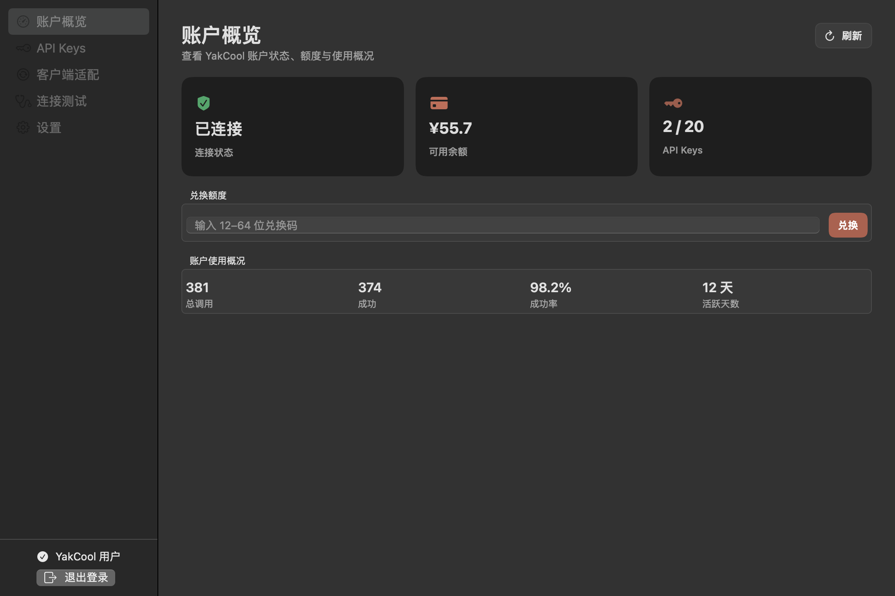
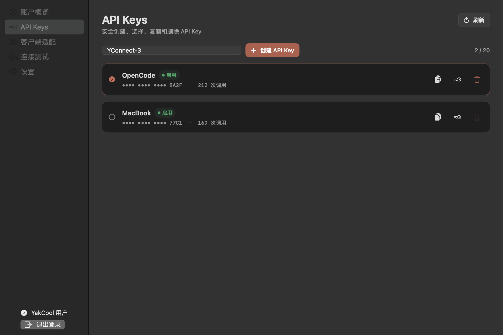
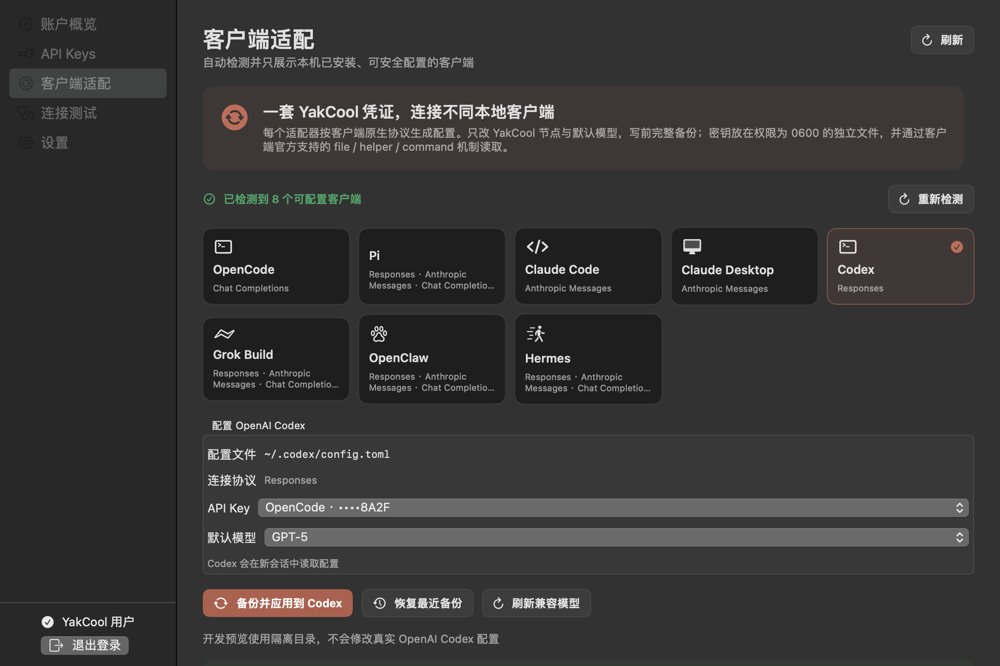
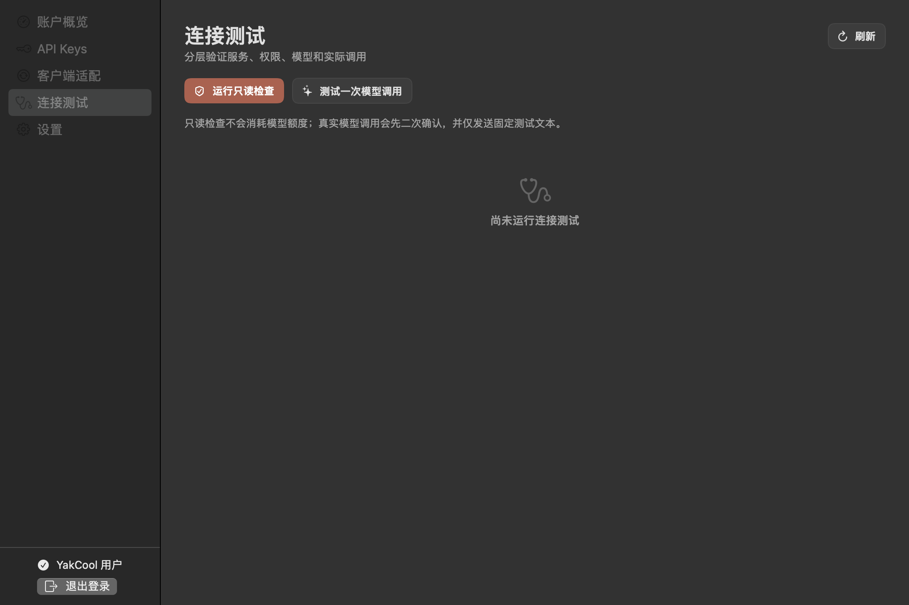
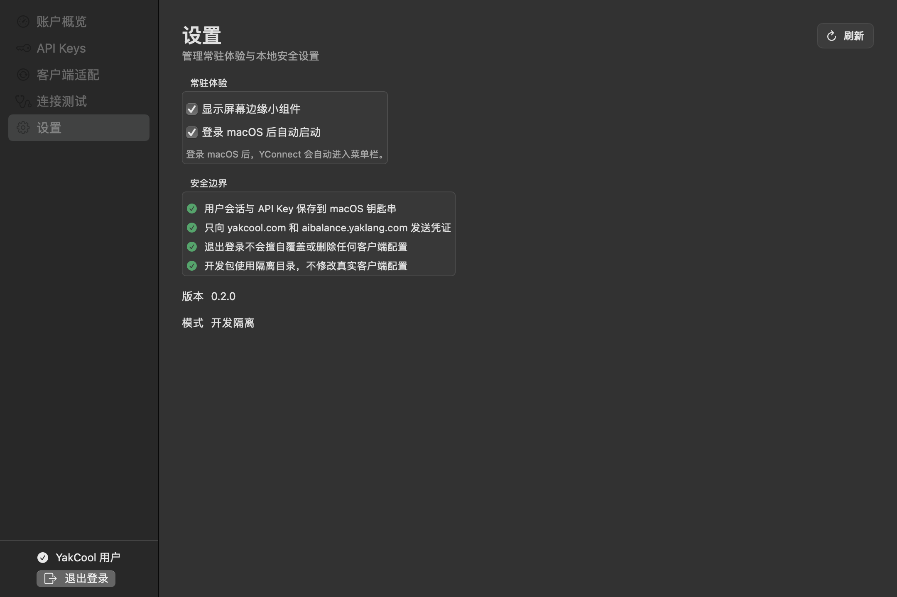
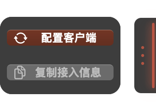

# YConnect macOS 交互基线与 Windows 适配规范

本文把已经在 macOS 端验证过的 YConnect 使用习惯固化为 Windows 实现基线。Windows 不需要逐像素复制 AppKit，但必须保持相同的信息层级、操作语义、安全边界和默认行为。

## 1. 基线与证据

| 项目 | 值 |
| --- | --- |
| macOS 基线提交 | `ce297b416aaf7d32e0c653cbee9ce19217ddaa90` |
| 截图生成日期 | 2026-09-05 |
| 截图来源 | 基线提交的 Release `YConnect` 二进制，通过内置渲染参数生成 |
| 数据来源 | `YConnectStore.preview` 内置离线 Mock 数据 |
| 网络与凭证 | `PreviewOfflineHTTPTransport` 拒绝网络请求；使用临时隔离目录，不读取真实 Keychain 或客户端配置 |

文中的界面截图是实际 SwiftUI/AppKit 代码的渲染结果，不是 Figma 稿或图像生成结果。截图用于说明布局和状态，不证明服务端实时数据或 Windows 已经实现对应能力。

## 2. 跨平台必须一致的原则

1. **小组件只承载高频操作。** 用户应能在不进入管理台的情况下查看连接状态、切换 Key、复制 Key、复制接入信息、复制协议 URL、选择模型和进入已安装客户端的配置页。
2. **管理台承载完整流程。** Key 管理、客户端配置预览与恢复、连接测试、启动项和安全说明均进入管理台，不继续堆叠在小组件里。
3. **账户登录和 API Key 登录是两种权限。** 账户会话可管理余额、兑换和 Key；API Key 模式只查询这把 Key 的额度、协议与模型，不能获得账户管理权限。
4. **只展示本机存在的客户端。** 小组件和管理台都必须做原生安装检测。未安装的应用不能伪装成可直接应用；已安装应用按最近使用顺序排列。
5. **协议能力来自当前 Key。** 不从公开模型目录猜测可调用能力。客户端与模型必须按 Responses、Chat Completions、Anthropic Messages 等真实协议交集筛选。
6. **复制操作就地完成。** Key 右侧有“复制 Key”；每条协议地址有独立“复制”；“复制/分享接入信息”一次复制 Key、协议地址和当前模型，并明确标记内容来自 YConnect。
7. **写配置之前先预览。** 应用配置必须先展示目标文件和修改摘要，确认后备份、原子写入、写后验证；失败或检测到外部修改时停止并允许恢复。
8. **免费检查与付费调用严格区分。** 基础检查只读且不调用模型；真实模型测试必须二次确认，并说明会消耗额度。
9. **默认随系统登录启动。** 正式安装包首次运行默认启用；用户明确关闭后必须保持关闭。开发、Mock 和自动化测试不能修改真实启动项。
10. **平台外观可不同，产品语义不可漂移。** macOS 菜单栏对应 Windows 通知区域；Keychain 对应 DPAPI；WKWebView 对应 WebView2，但文案、流程和边界保持一致。

## 3. 登录体验

### 3.1 YakCool 账户



*图 1：macOS 账户登录状态，内置离线 Mock 数据。*

- 默认打开“YAKCOOL 账户”。主操作为“在 YConnect 内扫码”，不能把用户直接丢到外部浏览器。
- macOS 使用原生窗口承载官方 HTTPS 页面；Windows 使用独立 WPF 窗口承载 WebView2。两端都只允许 YakCool 官方登录来源，并只提取公开用户会话。
- 登录容器应具备原生标题、加载状态、错误提示和关闭行为。成功后关闭登录窗口，回到已连接小组件。
- 恢复失败不能反复弹“尚未登录”。只在用户可采取行动时显示一次稳定的页内反馈，并提供重试入口。

### 3.2 API Key



*图 2：macOS API Key 登录状态，内置离线 Mock 数据。*

- API Key 使用安全输入框，并提供明确的“粘贴”按钮；回车和“验证并连接”执行同一验证逻辑。
- 输入框、粘贴按钮和主按钮必须对齐，不能出现原生控件高度不一致。
- 验证成功前不持久化输入；成功后按平台安全能力保存。错误提示不得回显完整 Key。
- UI 必须说明：此模式仅查询当前 Key，不授予账户管理权限。

## 4. 已连接小组件



*图 3：macOS 已连接、协议与模型均收起，内置离线 Mock 数据。*

信息顺序不得随平台改变：

1. 标题、当前身份摘要、刷新、固定、关闭。
2. “YakCool 账户已安全连接”状态条。
3. 账户概要：用户名、连接状态、余额、Key 数量和调用次数。
4. 当前连接：新增 Key、复制/分享接入信息、Key 选择和复制 Key。
5. 可展开的协议地址与模型。
6. 已安装客户端快捷操作。
7. 页内反馈。
8. “全部配置管理”和“登出”。

### 4.1 当前连接与复制

- 账户模式右上角展示“新增 API Key”，点击后打开管理台 API Keys 页面，并聚焦名称输入框。
- 默认名称从 `YConnect-1` 开始，跳过现有编号，选择第一个可用名称。
- Key 选择框与右侧“复制 Key”按钮高度一致；复制按钮不能远离当前 Key。
- “复制 Key”只复制裸 Key，适合粘贴到已有输入框。
- “复制/分享接入信息”复制可读文本，至少包含：YConnect 来源说明、允许用户按自身方式接入的提示、当前模型、全部协议 URL 和 API Key。
- 敏感内容复制成功后给出短暂反馈；正式客户端应按既定安全策略定时清理剪贴板。

推荐分享文本结构：

```text
以下接入信息由 YConnect 生成。
你可以按照自己的工具和使用习惯，选择合适的协议接入 YakCool。

模型: gpt-5
OpenAI 兼容基址: https://aibalance.yaklang.com/v1
Chat Completions: https://aibalance.yaklang.com/v1/chat/completions
Responses API: https://aibalance.yaklang.com/v1/responses
Anthropic 基址: https://aibalance.yaklang.com
Anthropic Messages: https://aibalance.yaklang.com/v1/messages
API Key: <当前 Key>
```

分享文本本身包含敏感凭证。界面不得用“公开分享”等会弱化风险的措辞。

### 4.2 协议地址和模型



*图 4：协议地址展开及模型选择状态，内置离线 Mock 数据。*

- “协议接入地址”可展开/收起。每条 URL 既可选择文本，也有独立复制按钮；复制后按钮短暂显示“已复制”。
- 协议地址和模型详情互斥展开，避免小组件过长。内容超过工作区时才启用垂直滚动。
- 模型收起时展示最近选择或热门推荐，允许直接复制模型 ID；展开后支持选择、复制和搜索。
- 模型数量较多时搜索名称、模型 ID 或协议；结果必须来自当前 Key 的真实权限。

### 4.3 客户端快捷操作

- 标题固定为“已安装客户端”，不能展示不存在的应用。
- 排序为最近使用优先，其余保持注册表稳定顺序。
- 本机不超过 4 个客户端时全部展示；超过 4 个时展示最近 3 个和“更多”。
- “应用到 Claude Code”等按钮不是立即覆盖配置，而是打开该客户端的管理页。
- 没检测到客户端时只展示一个可操作空状态，引导打开操作台重新检测。
- 底部使用“全部配置管理”和“登出”。“登出”只清除 YConnect 登录，不等同于退出进程，也不自动删除已应用的下游配置。

## 5. 完整管理台

### 5.1 账户概览



*图 5：账户概览，内置离线 Mock 数据。*

概览用于回答三个问题：当前是谁、还有多少可用额度、最近使用情况如何。统计卡片之后再展示 Key 摘要和客户端状态，避免把配置细节放在首页首屏。

### 5.2 API Keys



*图 6：API Keys 管理，内置离线 Mock 数据。*

- 展示 Key 数量与上限、状态、末四位、额度模式和操作。
- 新建、复制、设为当前和删除都在同一页面完成。
- 删除必须二次确认，并说明依赖该 Key 的客户端会立即失去访问权限。
- 从小组件进入新建流程时自动建议 `YConnect-N`，但允许用户修改名称。

### 5.3 客户端适配



*图 7：Codex 客户端配置页，内置离线 Mock 数据。*

- 左侧只列出检测到的客户端；右侧展示配置路径、原生协议、当前状态、Key、兼容模型、备份与恢复。
- 配置路径必须可复制。状态至少区分未配置、已配置、需更新、无法读取和需协议桥。
- 点击应用后先显示变更预览，再确认写入。成功后说明客户端何时重新读取配置。
- Gemini CLI 目前需要 Gemini-native 协议桥，不能用 OpenAI/Anthropic 配置伪装成功。

### 5.4 连接测试



*图 8：连接测试，内置离线 Mock 数据。*

- 基础检查顺序为服务健康、Key 权限、模型与协议，明确标注“不产生模型调用费用”。
- 真实模型调用放在独立区域。用户点击后弹出原生确认框，说明模型、固定测试内容与额度影响。
- 最小测试发送固定文本 `Reply exactly with OK.`，输出上限为 8 tokens；不能把任意用户输入带入诊断请求。

### 5.5 设置



*图 9：macOS 设置页，内置离线 Mock 数据。*

- 设置页分组展示屏幕边缘入口、随系统登录启动、凭证与本地数据说明。
- 正式安装包首次运行默认开启随系统登录启动；用户关闭后保留选择。
- 开发、预览与测试环境明确说明不会修改正式启动项或真实配置。

## 6. 屏幕边缘入口



*图 10：macOS 屏幕边缘入口，内置离线 Mock 数据。*

- 边缘入口是唤起小组件的快捷入口，不承载完整业务内容。
- 可沿当前屏幕上下拖动；支持左右侧切换，并在屏幕布局改变后保持可见。
- 正常悬停、点击和失焦行为不能抢占正在使用的其他应用焦点。
- macOS `NSPanel` 行为在 Windows 应映射为不进入任务栏的无边框 Topmost WPF 窗口，并按显示器工作区定位。

## 7. 视觉与布局 Token

Windows 可以使用 Segoe UI 和原生 WPF 控件，但应共享以下视觉语义：

| Token | macOS 基线 | Windows 要求 |
| --- | --- | --- |
| 强调色 | `#C76A55` | 全局强调、链接、选中态；不使用蓝色替代 |
| 主按钮 | `#B45D4B` | 白字，保持可读对比度 |
| 主按钮按下 | `#A94F3F` | 仅按下态，不作为错误色 |
| 成功色 | `#31A666` | 仅用于成功、已连接、已复制 |
| 小组件宽度 | 390 pt | 约 390–408 DIP，保持单列信息密度 |
| 外壳圆角 | 18 pt | 18–20 DIP；展开与收起均不能变成直角 |
| 内容边距 | 14 pt | 14–16 DIP |
| 基础间距 | 4 pt 网格 | 使用 4、8、12、16、20、24、28 等间距 |
| 登录高度 | 账户 380 pt；API Key 420 pt | 状态切换后高度稳定，无底部截断 |
| 收起留白 | 底部 28 pt 呼吸空间 | 不让页脚贴住窗口下缘 |

不要把主按钮色改回 YTray 的高饱和橙色，也不要使用蓝色作为默认强调色。错误态应使用克制的红色，不能与品牌主按钮混为一谈。

## 8. 平台能力映射

| 产品能力 | macOS | Windows |
| --- | --- | --- |
| 常驻入口 | `NSStatusItem` 菜单栏 | `NotifyIcon` 通知区域 |
| 小组件/边缘入口 | `NSPanel` / AppKit | 无边框 Topmost WPF Window + Win32 定位 |
| 扫码登录 | `WKWebView` 原生窗口 | WebView2 原生 WPF 窗口 |
| 会话与独立登录 Key | Keychain | DPAPI（CurrentUser） |
| 下游凭证文件 | 私有文件，`0600` | 当前用户显式私有 ACL |
| 备份目录 | 私有目录，`0700` | 当前用户显式私有 ACL |
| 随系统登录启动 | `SMAppService.mainApp` | `HKCU\\Software\\Microsoft\\Windows\\CurrentVersion\\Run`，或安装包等价机制 |
| 确认框 | AppKit/SwiftUI 原生确认 | WPF 模态对话框 |
| 文件打开/定位 | Workspace API | Explorer/Shell API |

Windows 不能用“平台不同”降低安全要求。DPAPI 只保护 YConnect 自己读取的凭证；若下游客户端必须读 Key 文件，还要对文件和父目录设置仅当前用户可访问的 ACL，并在写后验证。

## 9. Windows 当前对齐清单

以下结论基于合入主线的 Windows 原生实现，不代表未来版本状态。Windows 开发者完成一项后，应同时补测试和截图证据。

### P0：发布前必须对齐

- [ ] **只显示已安装客户端。** 当前 Windows 小组件会固定补齐 OpenCode、Codex、Claude Code、Pi，管理台也遍历全部注册项；应增加原生安装检测，并将最近使用排序应用到小组件和管理台。
- [ ] **首次默认开启随系统登录启动。** 当前 Windows 只提供手动注册表开关；应增加“首次成功启用后记录”语义，注册失败可重试，用户明确关闭后不得自动重新开启。
- [ ] **小组件复制入口对齐。** 当前 Windows 有“复制 Key”和协议地址，但需要补齐 macOS 的“复制/分享接入信息”主入口、就地模型 ID 复制和清晰的敏感信息提示。
- [ ] **底部语义对齐。** 小组件使用“全部配置管理”和“登出”，并保证登出不等于退出应用。
- [ ] **API Key 登录补粘贴按钮。** 当前 Windows `PasswordBox` 只有输入和验证；必须提供显式粘贴操作，并保持控件高度一致。

### P1：体验对齐

- [ ] 小组件的协议地址和模型详情互斥展开，只有内容超过屏幕工作区时滚动。
- [ ] 收起状态保留底部呼吸空间，展开和收起都保持连续圆角。
- [ ] 新增 API Key 从小组件进入 API Keys 页面，默认建议第一个可用的 `YConnect-N`。
- [ ] 登录恢复失败使用稳定页内状态，不重复弹出“尚未登录”。
- [ ] 管理台导航和信息架构对齐为：账户概览、API Keys、客户端适配、连接测试、设置。若 Windows 保留独立模型目录，应作为平台增强，不得挤占核心路径。
- [ ] Windows Release 截图至少覆盖本文十个对应状态，并在 100%、125%、150% 缩放下检查文字裁切和控件对齐。

## 10. Mock 数据定义

截图中的数字用于稳定复现布局，不是线上账户数据：

| 字段 | Mock 值 | 用途 |
| --- | --- | --- |
| 用户名 | `YakCool 用户` | 账户身份与标题布局 |
| Token 上限/已用/剩余 | 800,000,000 / 243,000,000 / 557,000,000 | 余额和进度展示 |
| 可用余额 | `¥55.70` | 按 Preview 固定换算展示 |
| 调用次数 | 381 | 概览指标 |
| 成功/失败/成功率 | 374 / 7 / 98.16% | 统计和状态布局 |
| API Keys | `OpenCode · ••••8A2F`、`MacBook · ••••77C1` | 选择、复制与管理流程 |
| 模型 | GPT-5、Claude Sonnet 4、GPT-5 Mini、GPT-5 Codex 等 | 搜索、协议筛选和复制模型 ID |
| 客户端 | 8 个正式适配器；Gemini CLI 为需协议桥 | 安装检测、排序和兼容性状态 |

Mock 数据必须在界面上标注为演示或在测试文档中明确来源。不能把 Mock 截图当作服务端可用性、账户余额或已成功写入真实客户端配置的证据。

## 11. 截图复现

在仓库根目录运行：

```bash
swift build --package-path darwin --configuration release -Xswiftc -warnings-as-errors
BIN="$(swift build --package-path darwin --configuration release --show-bin-path)/YConnect"

"$BIN" --render-widget /tmp/widget-account.png --signed-out
"$BIN" --render-widget /tmp/widget-api-key.png --signed-out --api-key-mode
"$BIN" --render-widget /tmp/widget-connected.png
"$BIN" --render-widget /tmp/widget-expanded.png --expanded-urls --expanded-models
"$BIN" --render-manager /tmp/manager-overview.png --section overview
"$BIN" --render-manager /tmp/manager-api-keys.png --section apiKeys
"$BIN" --render-manager /tmp/manager-clients.png --section clients --client codex
"$BIN" --render-manager /tmp/manager-diagnostics.png --section diagnostics
"$BIN" --render-manager /tmp/manager-settings.png --section settings
"$BIN" --render-edge-dock /tmp/edge-dock.png
```

渲染入口会创建临时 Preview 环境。不要为了截图注入生产 Cookie、API Key 或真实用户目录。

## 12. Windows 验收标准

Windows 组件完成后，至少提供以下可重复验证结果：

- Release 构建、单元测试和原生 Smoke 全部通过；便携包或安装包可在干净 Windows 10/11 x64 环境启动。
- 扫码登录在 WebView2 原生窗口中完成；来源限制、Cookie 范围和成功回传均有测试。
- API Key 粘贴、验证、错误脱敏、DPAPI 保存和剪贴板清理均有测试。
- 小组件只显示已安装客户端，并以最近使用排序；0、1、3、4、5 个客户端状态均有截图或自动化断言。
- 所有协议 URL 可独立复制；Key、模型 ID 和完整接入信息的复制逻辑互不混淆。
- 对每个客户端执行预览、应用、写后校验、并发修改拒绝和最近备份恢复；测试只使用隔离目录和假 Key。
- 基础检查不产生模型调用；真实测试有二次确认、固定文本和 8 tokens 上限。
- 首次默认启动、用户关闭后保持关闭、注册失败重试、开发环境不写启动项四条语义都有测试。
- 提交 100%、125%、150% 缩放下的十个对应界面截图，并逐项对照本文 P0/P1 清单。
